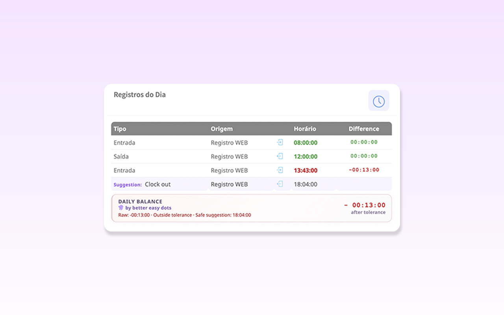
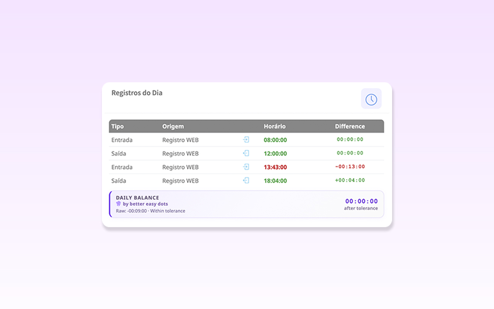
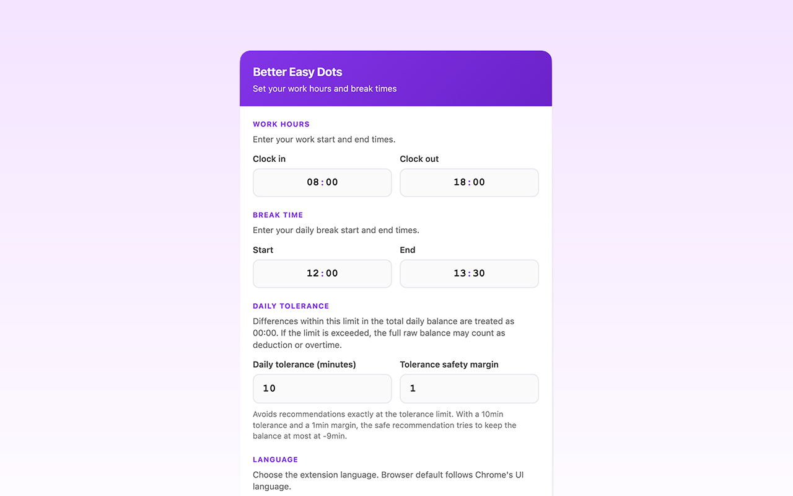

<p align="center">
  
</p>

<h1 align="center">Better Easy Dots</h1>

<p align="center">
  Chrome extension that improves time-clock registration on <strong>Easydots</strong> (<code>sys.easydots.com.br</code>).
</p>

<p align="center">
  <a href="README.md"></a>
  
  
  <a href="LICENSE"></a>
</p>

---

## About

**Better Easy Dots** is an unofficial extension that adds visual and productivity features to the Easydots time registration page. Everything runs in your browser: settings and calculations are stored in `chrome.storage.local`, with no data sent to external servers.

> **Disclaimer:** this extension is not affiliated with, endorsed by, or maintained by Easydots or ACS Pontodigital.

## Features

### Daily balance

Shows a row at the bottom of the records table with the day's hour balance:

- **Incomplete day:** shows how much work time is still missing (e.g. only clock-in → `-09:00:00`)
- **Complete day:** accounts for worked hours, expected schedule, and punch punctuality
- **Not configured:** displays a reminder to set your schedule via the gear icon

### Time colors

Each recorded time is colored according to your configured tolerance:

| Color | Meaning |
|-------|---------|
| Green | Within expected range |
| Yellow | Near the tolerance limit |
| Red | Late beyond tolerance |

### Punch suggestions

While the day is incomplete, **suggestion** rows show the next expected punches (clock-in, lunch break, etc.), adjusted for any delay on the first clock-in of the day.

### Settings

Dedicated page (`settings.html`) accessible via:

- Gear icon in the Easydots navbar
- Extension popup → **Settings**
- `chrome://extensions` → Details → Options

Configurable fields:

| Field | Description | Default |
|-------|-------------|---------|
| Clock-in | Workday start time | `08:00` |
| Clock-out | Workday end time | `18:00` |
| Break start | Lunch break start | `12:00` |
| Break end | Lunch break end | `13:00` |
| Late tolerance | Accepted minutes on clock-in | `5` |
| Easydots URL | Your company's URL | Auto-detected |

The Easydots URL is detected from the page you use — you do not need to be on `/site/login`.

### Icon badge

The extension icon in the Chrome toolbar shows the number of records for the day when an Easydots tab is open.

---

## Screenshots

### Punch suggestion and balance outside tolerance

**Difference** column, status colors, and a clock-out suggestion with raw balance outside tolerance:

<p align="center">
  
</p>

### Complete day within tolerance

Four recorded punches and a daily balance cleared after applying daily tolerance:

<p align="center">
  
</p>

### Settings

Work hours, break times, daily tolerance, safety margin, and language:

<p align="center">
  
</p>

---

## Installation

### Development (load unpacked)

1. Clone or download this repository
2. Open `chrome://extensions`
3. Enable **Developer mode**
4. Click **Load unpacked**
5. Select the project root folder (`easy-easy-dots`)

### Chrome Web Store

[Store draft](https://chromewebstore.google.com/detail/better-easy-dots/cfnehkkbmplomaianjpfiaoonmpekbbb) — the link will be public after publication.

---

## Quick start

1. Install the extension and open your company's Easydots
2. Click the **better easy dots** gear in the navbar (or open the popup → **Settings**)
3. Enter your work hours, break times, and tolerance
4. Click **Save**
5. In the records table, see colors, suggestions, and the daily balance

---

## Project structure

```
easy-easy-dots/
├── manifest.json          # Extension Manifest V3
├── config.js              # Store URL and default Easydots URL
├── background.js          # Service worker (badge, open settings)
├── content.js             # Logic on the Easydots page
├── content.css            # Injected page styles
├── settings.js            # Settings persistence and normalization
├── settings-ui.js         # Settings form component
├── settings-ui.css
├── settings.html          # Options page
├── settings-page.js
├── settings-page.css
├── popup.html             # Extension popup
├── popup.js
├── popup.css
├── icons/                 # Extension icons
└── docs/
    └── to-do.md           # Chrome Web Store release checklist
```

The `website/` folder contains a local mirror of the Easydots page for testing with Live Server (`127.0.0.1:5500`) and **must not** be included in the production package.

---

## Permissions

| Permission | Reason |
|------------|--------|
| `storage` | Save schedule and Easydots URL locally |
| `tabs` | Find an open Easydots tab to update the badge |
| `*.easydots.com.br` | Inject enhancements on the page you already opened |
| `*.acspontodigital.com.br` | Legacy domain compatibility |

No data is sent to extension servers.

---

## Privacy

- Settings stored only in `chrome.storage.local` on your device
- The extension reads the records table **only** on the Easydots tab you opened
- No analytics, telemetry, or user accounts
- No access to sites other than those configured in the manifest

---

## Compatibility

- **Browser:** Google Chrome (Manifest V3)
- **Sites:** `https://*.easydots.com.br/*` (default: `https://sys.easydots.com.br/`), `https://*.acspontodigital.com.br/*` (legacy)
- **Current version:** `1.3.0`

The extension depends on the current Easydots HTML structure (`#table_registro_horario`, `#btnRegister`, navbar). Site updates may require selector adjustments.

---

## Contributing

1. Fork the repository
2. Create a branch for your change
3. Test on real Easydots or the local mirror
4. Open a pull request describing the change

---

## License

Distributed under the [MIT License](LICENSE).
