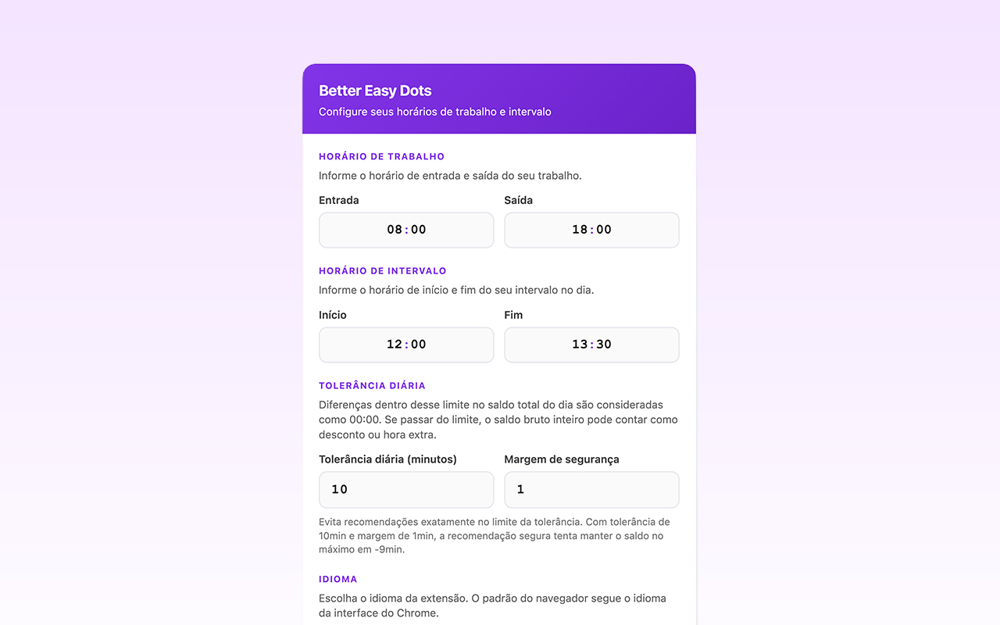

<p align="center">
  
</p>

<h1 align="center">Better Easy Dots</h1>

<p align="center">
  Extensão para <strong>Chrome</strong> e <strong>Firefox</strong> que melhora a experiência de registro de ponto no <strong>Easydots</strong> (<code>sys.easydots.com.br</code>).
</p>

<p align="center">
  <a href="README.en.md"></a>
  
  
  
  
  <a href="LICENSE"></a>
</p>

---

## Sobre

**Better Easy Dots** é uma extensão não oficial que adiciona recursos visuais e de produtividade à página de registro de horário do Easydots. Tudo roda no seu navegador: configurações e cálculos ficam no storage local da extensão, sem envio de dados a servidores externos.

> **Aviso:** esta extensão não é afiliada, endossada ou mantida pelo Easydots nem pela ACS Pontodigital.

## Funcionalidades

### Saldo do dia

Exibe uma linha no final da tabela de registros com o saldo de horas do dia:

- **Dia incompleto:** mostra quanto ainda falta trabalhar (ex.: só a entrada → `-09:00:00`)
- **Dia completo:** considera horas trabalhadas, jornada esperada e pontualidade nas batidas
- **Sem configuração:** exibe um lembrete para configurar horários na engrenagem

### Cores nos horários

Cada horário registrado recebe uma cor conforme a tolerância configurada:

| Cor | Significado |
|-----|-------------|
| Verde | Dentro do esperado |
| Amarelo | Próximo do limite da tolerância |
| Vermelho | Atraso além da tolerância |

### Sugestões de batida

Enquanto o dia não está completo, linhas de **sugestão** mostram as próximas batidas esperadas (entrada, saída para intervalo, etc.), ajustadas pelo atraso da primeira entrada do dia.

### Configurações

Página dedicada (`settings.html`) acessível por:

- Ícone de engrenagem na navbar do Easydots
- Popup da extensão → **Configurações**
- Página de opções do navegador (Chrome / Firefox)

Campos configuráveis:

| Campo | Descrição | Padrão |
|-------|-----------|--------|
| Entrada | Horário de início da jornada | `08:00` |
| Saída | Horário de fim da jornada | `18:10` |
| Início do intervalo | Saída para almoço | `12:00` |
| Fim do intervalo | Retorno do almoço | `13:30` |
| Tolerância de atraso | Minutos aceitos na entrada | `5` |
| Endereço do Easydots | URL da sua empresa | Detectada automaticamente |

O endereço do Easydots é identificado pela página em que você usa o sistema — não é necessário estar em `/site/login`.

### Badge no ícone

O ícone da extensão na barra do navegador mostra a quantidade de registros do dia quando uma aba do Easydots está aberta.

---

## Capturas de tela

### Sugestão de batida e saldo fora da tolerância

Coluna **Diferença**, cores por status e sugestão de saída com saldo bruto fora da tolerância:

<p align="center">
  
</p>

### Dia completo dentro da tolerância

Quatro batidas registradas e saldo do dia zerado após a tolerância diária:

<p align="center">
  
</p>

### Configurações

Horários de trabalho, intervalo, tolerância diária, margem de segurança e idioma:

<p align="center">
  
</p>

---

## Instalação

### Desenvolvimento — Chrome

1. Clone ou baixe este repositório
2. Abra `chrome://extensions`
3. Ative **Modo do desenvolvedor**
4. Clique em **Carregar sem compactação**
5. Selecione a pasta raiz do projeto

### Desenvolvimento — Firefox

1. Clone ou baixe este repositório
2. Rode `npm run firefox:dev`
3. Abra `about:debugging#/runtime/this-firefox`
4. Clique em **Carregar complemento temporário…**
5. Selecione `load-in-firefox/manifest.json`

Detalhes: [`docs/firefox.md`](docs/firefox.md).

### Chrome Web Store

[Chrome Web Store](https://chromewebstore.google.com/detail/better-easy-dots/cfnehkkbmplomaianjpfiaoonmpekbbb)

### Firefox Add-ons (AMO)

Listagem em preparação. Após a primeira publicação, o link ficará em `config.js` (`EED_FIREFOX_STORE_URL`).

### Empacotar para as lojas

```bash
npm install
npm run package
```

Gera:

- `builds/better-easy-dots-chrome-vX.Y.Z.zip`
- `builds/better-easy-dots-firefox-vX.Y.Z.zip`

Cada ZIP tem `manifest.json` na raiz e passa pela validação automática. Siga [`RELEASE_CHECKLIST.md`](RELEASE_CHECKLIST.md) antes de enviar.

```bash
npm run package:chrome    # só Chrome
npm run package:firefox   # só Firefox
npm test                  # validate:json + package
npm run lint:firefox      # package Firefox + web-ext lint
```

---

## Uso rápido

1. Instale a extensão e abra o Easydots da sua empresa
2. Clique na engrenagem **better easy dots** na navbar (ou abra o popup → **Configurações**)
3. Informe seus horários de trabalho, intervalo e tolerância
4. Clique em **Salvar**
5. Na tabela de registros, veja cores, sugestões e o saldo do dia

---

## Estrutura do projeto

```
better-easy-dots/
├── manifest.json                 # Chrome (dev, com localhost)
├── manifest.prod.json            # Chrome (loja)
├── manifest.firefox.json         # Firefox (dev)
├── manifest.firefox.prod.json    # Firefox (AMO)
├── browser-compat.js             # Ponte única chrome/browser para Chrome + Firefox
├── config.js                     # URLs das lojas + Easydots padrão
├── background.js                 # Badge, abrir configurações/changelog
├── content.js                    # Lógica na página do Easydots
├── scripts/
│   ├── package-extension.js
│   └── validate-extension-package.js
├── .github/workflows/            # CI + Release
├── docs/
│   └── firefox.md
└── …
```

A pasta `website/` contém um espelho local da página do Easydots para testes com Live Server (`127.0.0.1:5500`) e **não** deve ser incluída no pacote de produção. Pastas geradas `dist/` e `builds/` estão no `.gitignore`.

---

## Permissões

| Permissão | Motivo |
|-----------|--------|
| `storage` | Salvar horários e URL do Easydots localmente |
| `tabs` | Localizar aba aberta do Easydots para atualizar o badge |
| `windows` | Focar a janela ao reabrir configurações/changelog (permissão Chrome; API sem permissão no Firefox) |
| `*.easydots.com.br` | Injetar melhorias na página já aberta pelo usuário |
| `*.acspontodigital.com.br` | Compatibilidade com domínio legado |

Nenhum dado é transmitido para servidores da extensão.

---

## Privacidade

- Configurações armazenadas apenas no storage local da extensão no seu dispositivo
- A extensão lê a tabela de registros **somente** na aba do Easydots que você abriu
- Sem analytics, telemetria ou conta de usuário
- Sem acesso a outros sites além dos domínios configurados no manifest

---

## Compatibilidade

- **Navegadores:** Google Chrome e Mozilla Firefox (Manifest V3)
- **Sites:** `https://*.easydots.com.br/*` (padrão: `https://sys.easydots.com.br/`), `https://*.acspontodigital.com.br/*` (legado)
- **Versão atual:** `1.7.2`
- **Gecko ID:** `better-easy-dots@matheuspass.dev`

A extensão depende da estrutura HTML atual do Easydots (`#table_registro_horario`, `#btnRegister`, navbar). Atualizações no site podem exigir ajustes nos seletores.

Toda implementação nova deve manter paridade entre Chrome e Firefox: mesma UI, mesmos estilos, mesmas funcionalidades e validação em ambos os pacotes. APIs assíncronas de navegador devem passar por `browser-compat.js`.

---

## Contribuindo

1. Faça um fork do repositório
2. Crie uma branch para sua alteração
3. Teste no Easydots real ou no espelho local em Chrome e Firefox
4. Abra um pull request descrevendo a mudança

---

## Licença

Distribuído sob a [Licença MIT](LICENSE).
