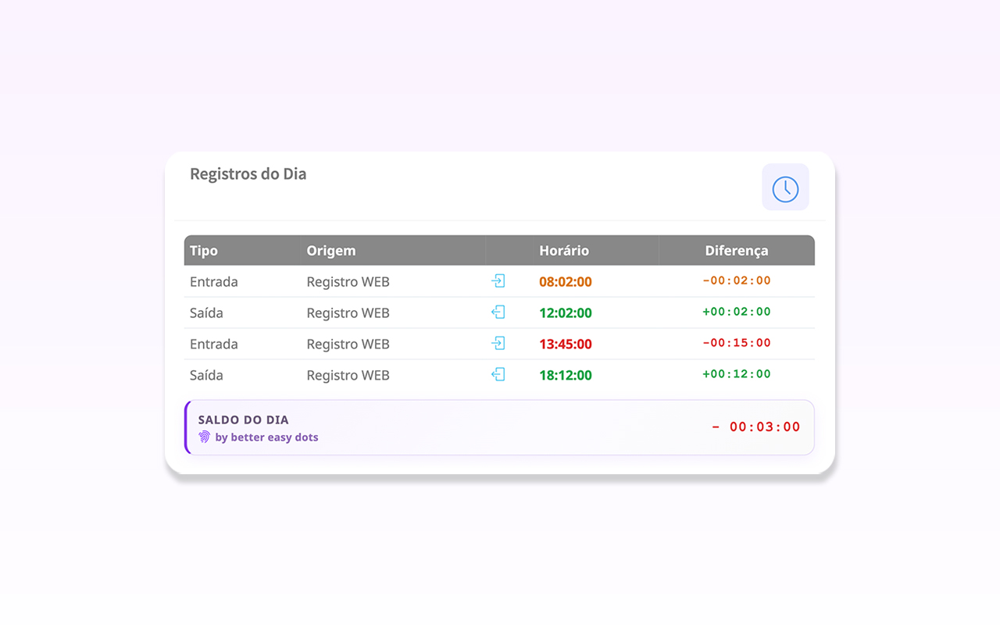
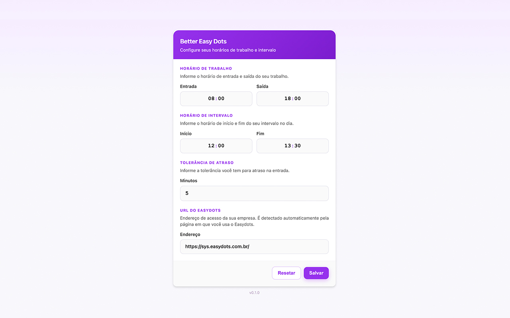

<p align="center">
  
</p>

<h1 align="center">Better Easy Dots</h1>

<p align="center">
  Extensão para Chrome que melhora a experiência de registro de ponto no <strong>Easydots</strong> (<code>sys.easydots.com.br</code>).
</p>

<p align="center">
  <a href="README.en.md"></a>
  
  
  <a href="LICENSE"></a>
</p>

---

## Sobre

**Better Easy Dots** é uma extensão não oficial que adiciona recursos visuais e de produtividade à página de registro de horário do Easydots. Tudo roda no seu navegador: configurações e cálculos ficam em `chrome.storage.local`, sem envio de dados a servidores externos.

> **Aviso:** esta extensão não é afiliada, endossada ou mantida pelo Easydots nem pela ACS Pontodigital.

## Funcionalidades

### Saldo do dia

Exibe uma linha no final da tabela de registros com o saldo de horas do dia:

- **Dia incompleto:** mostra quanto ainda falta trabalhar (ex.: só a entrada → `-09:00:00`)
- **Dia completo:** considera horas trabalhadas, jornada esperada e pontualidade nas batidas
- **Sem configuração:** exibe um lembrete para configurar horários na engrenagem

### Cores nos horários

Cada horário registrado recebe uma cor conforme a tolerância configurada:

| Cor | Significado |
|-----|-------------|
| Verde | Dentro do esperado |
| Amarelo | Próximo do limite da tolerância |
| Vermelho | Atraso além da tolerância |

### Sugestões de batida

Enquanto o dia não está completo, linhas de **sugestão** mostram as próximas batidas esperadas (entrada, saída para intervalo, etc.), ajustadas pelo atraso da primeira entrada do dia.

### Configurações

Página dedicada (`settings.html`) acessível por:

- Ícone de engrenagem na navbar do Easydots
- Popup da extensão → **Configurações**
- `chrome://extensions` → Detalhes → Opções

Campos configuráveis:

| Campo | Descrição | Padrão |
|-------|-----------|--------|
| Entrada | Horário de início da jornada | `08:00` |
| Saída | Horário de fim da jornada | `18:00` |
| Início do intervalo | Saída para almoço | `12:00` |
| Fim do intervalo | Retorno do almoço | `13:00` |
| Tolerância de atraso | Minutos aceitos na entrada | `5` |
| Endereço do Easydots | URL da sua empresa | Detectada automaticamente |

O endereço do Easydots é identificado pela página em que você usa o sistema — não é necessário estar em `/site/login`.

### Badge no ícone

O ícone da extensão na barra do Chrome mostra a quantidade de registros do dia quando uma aba do Easydots está aberta.

---

## Capturas de tela

### Tabela de registros

Saldo do dia, coluna **Diferença** e cores por tolerância:

<p align="center">
  
</p>

### Configurações

Horários de trabalho, intervalo, tolerância e URL do Easydots:

<p align="center">
  
</p>

---

## Instalação

### Desenvolvimento (carregar sem compactação)

1. Clone ou baixe este repositório
2. Abra `chrome://extensions`
3. Ative **Modo do desenvolvedor**
4. Clique em **Carregar sem compactação**
5. Selecione a pasta raiz do projeto (`easy-easy-dots`)

### Chrome Web Store

[Rascunho na loja](https://chromewebstore.google.com/detail/better-easy-dots/cfnehkkbmplomaianjpfiaoonmpekbbb) — o link ficará público após a publicação.

---

## Uso rápido

1. Instale a extensão e abra o Easydots da sua empresa
2. Clique na engrenagem **better easy dots** na navbar (ou abra o popup → **Configurações**)
3. Informe seus horários de trabalho, intervalo e tolerância
4. Clique em **Salvar**
5. Na tabela de registros, veja cores, sugestões e o saldo do dia

---

## Estrutura do projeto

```
easy-easy-dots/
├── manifest.json          # Manifest V3 da extensão
├── config.js              # URL da loja e URL padrão do Easydots
├── background.js          # Service worker (badge, abrir configurações)
├── content.js             # Lógica na página do Easydots
├── content.css            # Estilos injetados na página
├── settings.js            # Persistência e normalização de configurações
├── settings-ui.js         # Componente do formulário de configurações
├── settings-ui.css
├── settings.html            # Página de opções
├── settings-page.js
├── settings-page.css
├── popup.html             # Popup da extensão
├── popup.js
├── popup.css
├── icons/                 # Ícones da extensão
└── docs/
    └── to-do.md           # Checklist para publicação na loja
```

A pasta `website/` contém um espelho local da página do Easydots para testes com Live Server (`127.0.0.1:5500`) e **não** deve ser incluída no pacote de produção.

---

## Permissões

| Permissão | Motivo |
|-----------|--------|
| `storage` | Salvar horários e URL do Easydots localmente |
| `tabs` | Localizar aba aberta do Easydots para atualizar o badge |
| `*.easydots.com.br` | Injetar melhorias na página já aberta pelo usuário |
| `*.acspontodigital.com.br` | Compatibilidade com domínio legado |

Nenhum dado é transmitido para servidores da extensão.

---

## Privacidade

- Configurações armazenadas apenas em `chrome.storage.local` no seu dispositivo
- A extensão lê a tabela de registros **somente** na aba do Easydots que você abriu
- Sem analytics, telemetria ou conta de usuário
- Sem acesso a outros sites além dos domínios configurados no manifest

---

## Compatibilidade

- **Navegador:** Google Chrome (Manifest V3)
- **Sites:** `https://*.easydots.com.br/*` (padrão: `https://sys.easydots.com.br/`), `https://*.acspontodigital.com.br/*` (legado)
- **Versão atual:** `1.1.0`

A extensão depende da estrutura HTML atual do Easydots (`#table_registro_horario`, `#btnRegister`, navbar). Atualizações no site podem exigir ajustes nos seletores.

---

## Contribuindo

1. Faça um fork do repositório
2. Crie uma branch para sua alteração
3. Teste no Easydots real ou no espelho local
4. Abra um pull request descrevendo a mudança

---

## Licença

Distribuído sob a [Licença MIT](LICENSE).
